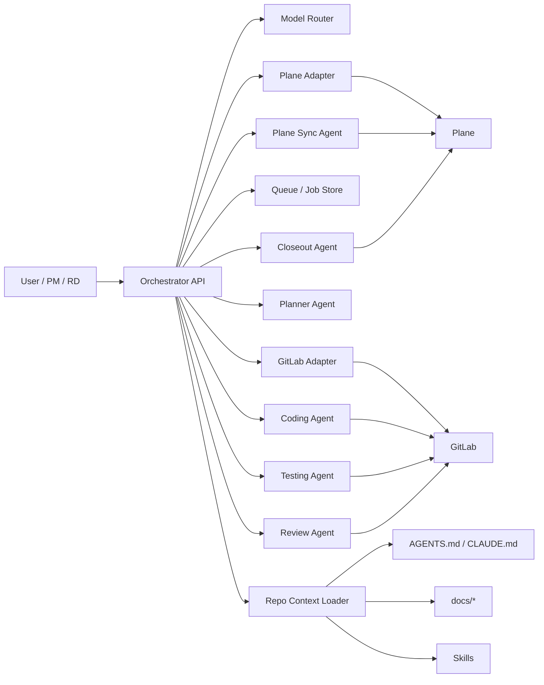

# Plane + GitLab + 多模型 Token + AGENTS.md + Skills + Review/Testing Agent 實戰架構

> 版本：v1.0  
> 適用對象：想把需求討論、任務拆解、寫 code、測試、Code Review 串成可落地 AI Agent 工作流的團隊  
> 建議語言：TypeScript  
> 建議 Orchestrator：`uexpresso` / Node.js

---

## 1. 文件目的

本文件定義一套可落地的 AI Agent 架構，讓專案可以達成以下流程：

1. 人類只需要用自然語言描述需求
2. Planner Agent 自動整理需求、拆出工作清單
3. 系統自動把任務寫入 Plane
4. Coding Agent 依工作清單讀取專案規則並實作程式碼
5. Testing Agent 自動執行 lint / test / build / typecheck
6. Review Agent 自動進行 Code Review
7. 完成後回寫 GitLab 與 Plane 狀態

這份文件特別針對 **Codex + Claude 雙工具共存** 設計，讓你可以在同一個 repo 中同時提供：

- 給 Codex 用的 `AGENTS.md`、`.codex/skills/`
- 給 Claude 用的 `CLAUDE.md`、`.claude/skills/`
- 給兩邊共用的 `docs/` 架構文件與專案規則

---

## 2. 核心設計原則

### 2.1 單一事實來源（Single Source of Truth）

- 任務狀態：以 **Plane** 為主
- 程式變更：以 **GitLab Merge Request** 為主
- 專案規則：以 **repo 內文件** 為主
- 執行規範：以 `AGENTS.md` / `CLAUDE.md` 為入口
- 重複工作流：以 `SKILL.md` 為單位管理

### 2.2 文件與規則都要版本化

所有 AI Agent 依賴的規則都必須跟著 repo 走，不要只放在：

- 聊天紀錄
- 個人腦中
- 雲端筆記
- 口頭傳承

### 2.3 模型只負責推理，驗證一定靠工具

模型可以：
- 做規劃
- 寫程式
- 分析錯誤
- 提出 review 意見

但最終正確性一定要靠：
- test
- lint
- build
- typecheck
- MR pipeline
- 外部 status check

### 2.4 Agent 要分工，不要一顆大腦包全部

建議至少切成：
- Planner Agent
- Plane Sync Agent
- Coding Agent
- Testing Agent
- Review Agent
- Closeout Agent

---

## 3. 整體架構圖



---

## 4. 元件分層

## 4.1 Orchestrator API

建議使用 TypeScript 撰寫，角色如下：

- 接收你的自然語言需求
- 呼叫 Planner Agent 產生任務清單
- 寫入 Plane
- 依任務狀態呼叫不同 Agent
- 接收 GitLab / Plane Webhook
- 控制重試、鎖定、去重、審計 log

建議不要讓外部系統直接呼叫 Coding Agent；所有事件先進 Orchestrator。

---

## 4.2 Model Router

不要把所有 Agent 都綁同一家模型。

建議：

- Planner Agent：高推理模型
- Coding Agent：最擅長 repo 修改與工具使用的模型
- Testing Agent：偏便宜但反應快的模型
- Review Agent：穩定且成本可控的模型
- Summary / Closeout：低成本模型即可

### 建議環境變數

```env
OPENAI_API_KEY=
ANTHROPIC_API_KEY=
GOOGLE_API_KEY=
OPENROUTER_API_KEY=
DEFAULT_PLANNER_MODEL=
DEFAULT_CODING_MODEL=
DEFAULT_TEST_MODEL=
DEFAULT_REVIEW_MODEL=
```

---

## 4.3 Plane Adapter

Plane 負責任務與狀態管理。

### 職責
- 建立 parent task / sub task
- 更新 state、label、module、cycle
- 寫入 MR 連結、commit、測試摘要
- 收到 webhook 後同步狀態

### 建議資料欄位

每張 Plane 任務至少補這些欄位：

- `source_type`: feature / bug / refactor / infra / review
- `source_repo`: 專案 repo 名稱
- `git_branch`
- `git_mr_url`
- `acceptance_criteria`
- `test_scope`
- `agent_owner`
- `parent_issue_id`

---

## 4.4 GitLab Adapter

GitLab 負責程式碼生命週期。

### 職責
- 建立 branch
- 建立 Merge Request
- 查詢 pipeline 結果
- 回貼 MR note / discussion
- 寫入 external status checks
- merge 後觸發 Closeout Agent

### 建議整合點
- Project Webhooks
- Merge Request API
- Notes / Discussions API
- Merge Request Pipelines
- External Status Checks

---

## 4.5 Repo Context Loader

Repo Context Loader 不是模型，而是上下文組裝器。

### 職責
- 讀取 `AGENTS.md`
- 讀取 `CLAUDE.md`
- 讀取 `docs/architecture/*`
- 讀取 `docs/review/*`
- 讀取對應 Skill 的 `SKILL.md`
- 把必要資訊餵給對應 Agent

### 原則
只提供任務需要的上下文，不要把整個 repo 一次塞爆。

---

## 5. Agent 分工定義

## 5.1 Planner Agent

### 目標
把自然語言需求轉成可執行任務。

### 輸入
- 使用者需求
- 既有架構文件
- 相關模組文件

### 輸出
- 需求摘要
- 影響範圍
- 風險清單
- 驗收標準
- 工作清單
- 是否需要 migration / test / review 補件

### 產出格式建議

```json
{
  "title": "Plane 與 GitLab 任務同步",
  "goal": "讓需求、MR、測試狀態能雙向追蹤",
  "risks": ["狀態循環更新", "Webhook 重複事件"],
  "acceptance_criteria": [
    "建立 MR 後自動回寫 Plane",
    "MR merged 後 Plane 自動進 Done"
  ],
  "tasks": [
    {"type": "backend", "title": "實作 Plane adapter"},
    {"type": "backend", "title": "實作 GitLab webhook handler"},
    {"type": "test", "title": "補 webhook 簽章驗證測試"}
  ]
}
```

---

## 5.2 Plane Sync Agent

### 目標
把 Planner 結果轉成 Plane 任務。

### 工作內容
- 建 parent task
- 建 sub task
- 補上 label / module / priority
- 寫入 acceptance criteria
- 任務完成後自動結案摘要

---

## 5.3 Coding Agent

### 目標
依任務與 repo 規則實作程式碼。

### 工作內容
- 讀取對應 task
- 讀取 `AGENTS.md` / `CLAUDE.md`
- 找可用 Skill
- 建 branch
- 實作程式
- 補單元測試或整合測試
- commit / push / 建 MR

### 強制規則
- 不可跳過 test
- 不可修改不在任務範圍內的檔案
- 重大設計變更前要先更新 plan
- 若 schema / contract 改變，必須同步更新 docs

---

## 5.4 Testing Agent

### 目標
自動驗證變更是否可安全合併。

### 工作內容
- 跑 lint
- 跑 unit tests
- 跑 integration tests
- 跑 build
- 跑 typecheck
- 分析 pipeline failure
- 視情況自動修復後再推 commit

### 建議指令範例

```bash
npm run lint
npm run test
npm run build
npm run typecheck
```

---

## 5.5 Review Agent

### 目標
站在 reviewer 角度進行程式碼審查。

### 工作內容
- 看 diff
- 看測試是否補齊
- 看是否破壞既有 contract
- 看是否引入循環同步、重入、冪等性問題
- 在 MR 留下 blocking / non-blocking 意見
- 回填 external status

### Review 重點
- 錯誤處理
- schema 驗證
- webhook 簽章驗證
- idempotency
- retry / timeout
- log 與 trace 能不能追
- secret 是否洩漏

---

## 5.6 Closeout Agent

### 目標
在 MR merge 後完成收尾。

### 工作內容
- 更新 Plane 任務狀態
- 附上 MR URL / commit SHA
- 寫入 release note 摘要
- 必要時更新 changelog / docs

---

## 6. 建議 repo 結構

> 這份結構是為了讓 **Codex** 與 **Claude** 都能讀到同一套專案知識，但各自有自己的原生入口檔。

```text
repo/
├─ AGENTS.md
├─ CLAUDE.md
├─ .codex/
│  └─ skills/
│     ├─ implementation-strategy/
│     │  └─ SKILL.md
│     ├─ plane-task-sync/
│     │  └─ SKILL.md
│     ├─ code-change-verification/
│     │  └─ SKILL.md
│     ├─ pipeline-fix/
│     │  └─ SKILL.md
│     ├─ mr-review/
│     │  └─ SKILL.md
│     └─ closeout-summary/
│        └─ SKILL.md
├─ .claude/
│  ├─ settings.json
│  └─ skills/
│     ├─ implementation-strategy/
│     │  └─ SKILL.md
│     ├─ plane-task-sync/
│     │  └─ SKILL.md
│     ├─ code-change-verification/
│     │  └─ SKILL.md
│     ├─ pipeline-fix/
│     │  └─ SKILL.md
│     ├─ mr-review/
│     │  └─ SKILL.md
│     └─ closeout-summary/
│        └─ SKILL.md
├─ docs/
│  ├─ architecture/
│  │  ├─ system-overview.md
│  │  ├─ plane-gitlab-sync.md
│  │  └─ state-machine.md
│  ├─ review/
│  │  ├─ CODE_REVIEW.md
│  │  └─ TESTING_POLICY.md
│  ├─ plans/
│  │  ├─ active/
│  │  └─ completed/
│  ├─ contracts/
│  │  ├─ plane-work-item-schema.md
│  │  ├─ gitlab-mr-schema.md
│  │  └─ webhook-payloads.md
│  └─ runbooks/
│     ├─ ci-failure.md
│     └─ rollback.md
├─ scripts/
│  ├─ verify.sh
│  ├─ review-check.sh
│  └─ sync-plane.sh
├─ src/
└─ .gitlab-ci.yml
```

---

## 7. Codex 與 Claude 的共存策略

## 7.1 共通原則

- **共通知識** 放在 `docs/`
- **Codex 入口** 放在 `AGENTS.md`
- **Claude 入口** 放在 `CLAUDE.md`
- **共通 workflow 名稱** 盡量一致
- **Skill 名稱與描述** 兩邊維持一致

這樣做的好處是：
- 知識不重複
- 不同 AI 工具都能讀
- 未來換工具也不會整包報廢

## 7.2 AGENTS.md 寫法建議

只放「每次都必須遵守」的全域規則，例如：

- 回覆語言
- build / test 指令
- 什麼情況必須更新 docs
- 什麼情況必須先用 plan
- 哪些 Skill 是強制的

## 7.3 CLAUDE.md 寫法建議

內容可與 `AGENTS.md` 高度相似，但語氣可以更偏 Claude Code 實際工作流，例如：

- 啟動任務時先讀 `docs/architecture/`
- 變更前先建立計畫
- 寫完後一定跑 `scripts/verify.sh`
- 需要 Code Review 時先用 `mr-review` skill

## 7.4 技術建議

不要把整套規則只寫在 `AGENTS.md` 或只寫在 `CLAUDE.md`。

正確做法：
- `AGENTS.md` / `CLAUDE.md` 都保持精簡
- 詳細規格寫到 `docs/`
- 重複流程寫到 Skills

---

## 8. Skills 設計規範

每個 skill 只做一件明確的事。

### 第一批建議 Skills

1. `implementation-strategy`
   - 功能：需求拆解、風險分析、設計策略

2. `plane-task-sync`
   - 功能：將任務寫入 Plane、更新狀態、附上外部連結

3. `code-change-verification`
   - 功能：執行 lint/test/build/typecheck

4. `pipeline-fix`
   - 功能：分析 CI 失敗並提出修正

5. `mr-review`
   - 功能：檢查 diff、風險、缺失測試、文件是否遺漏

6. `closeout-summary`
   - 功能：整理 MR 與 Plane 的結案摘要

### Skill 目錄範例

```text
mr-review/
├─ SKILL.md
├─ references/
│  ├─ review-checklist.md
│  └─ common-bugs.md
└─ scripts/
   └─ review-check.sh
```

### SKILL.md 範本

```md
---
name: mr-review
description: 審查 Merge Request，檢查測試、風險、文件與同步邏輯問題
---

# 使用時機
- 當任務已完成並建立 MR
- 當需要判斷是否可進入 merge 階段

# 必做檢查
1. 是否有對應測試
2. 是否破壞資料契約
3. 是否有 idempotency 風險
4. 是否有 webhook 重複觸發風險
5. 是否更新必要文件

# 輸出格式
- Blocking issues
- Non-blocking issues
- 建議補件
- 結論
```

---

## 9. 建議 AGENTS.md 骨架

> 下面這段可以直接拆成你 repo 的 `AGENTS.md`

```md
# AGENTS.md

## 專案工作原則
- 回覆語言：繁體中文
- 程式語言：TypeScript
- 變更原則：小步提交、可測試、可回滾、可追蹤
- 需求變更前先閱讀 `docs/architecture/`
- 若涉及流程調整，先更新 `docs/plans/active/`

## 強制流程
1. 實作前先確認是否需要使用 `implementation-strategy`
2. 任務同步到 Plane 時必須使用 `plane-task-sync`
3. 程式修改後一定執行 `code-change-verification`
4. 提交 MR 前一定使用 `mr-review`
5. Merge 後整理結案摘要

## 驗證指令
- `npm run lint`
- `npm run test`
- `npm run build`
- `npm run typecheck`

## 文件同步規則
- 若變更 API、schema、事件流，必須同步更新 `docs/contracts/` 與 `docs/architecture/`
- 若變更 review 規則，必須同步更新 `docs/review/`

## 禁止事項
- 不可跳過測試
- 不可未驗證就修改核心同步邏輯
- 不可在未更新文件時直接結案
```

---

## 10. 建議 CLAUDE.md 骨架

> 下面這段可以直接拆成你 repo 的 `CLAUDE.md`

```md
# CLAUDE.md

## Project Rules
- 使用繁體中文回覆
- 使用 TypeScript 實作
- 先讀 `docs/architecture/` 與 `docs/contracts/`
- 實作前先整理計畫
- 變更完成後必跑驗證腳本

## Mandatory Workflow
1. 規劃需求時優先使用 `implementation-strategy`
2. 寫入 Plane 任務時使用 `plane-task-sync`
3. 修改程式後執行 `code-change-verification`
4. 建立 MR 前先使用 `mr-review`
5. Merge 後整理 `closeout-summary`

## Verification Commands
- `npm run lint`
- `npm run test`
- `npm run build`
- `npm run typecheck`

## Documentation Rules
- API / schema / webhook 流程變更時，同步更新 `docs/contracts/` 與 `docs/architecture/`
- 重大設計調整時，先更新 `docs/plans/active/`
```

---

## 11. GitLab CI / Review 閘門建議

### 最小可行 CI 階段

```yaml
stages:
  - lint
  - test
  - build
  - review

lint:
  stage: lint
  script:
    - npm ci
    - npm run lint

unit_test:
  stage: test
  script:
    - npm ci
    - npm run test

build:
  stage: build
  script:
    - npm ci
    - npm run build

ai_review_gate:
  stage: review
  script:
    - echo "Review Agent result handled by external status check"
```
```

### Merge Gate 建議

- protected branch
- MR pipeline 必須成功
- External status check 必須成功
- Review Agent 若有 blocking issue，禁止 merge

---

## 12. Plane 狀態流建議

### 任務生命週期

1. Backlog
2. Planned
3. In Progress
4. In Review
5. Ready to Merge
6. Done
7. Released
8. Blocked / Cancelled

### 建議責任歸屬

- Planned：Planner Agent / PM
- In Progress：Coding Agent
- In Review：Testing Agent / Review Agent
- Ready to Merge：Review Agent
- Done：Closeout Agent
- Released：Release 流程或 PM

---

## 13. 事件流轉範例

## 13.1 新需求進來

1. 使用者描述需求
2. Orchestrator 呼叫 Planner Agent
3. Planner 產出任務清單
4. Plane Sync Agent 建立 parent + sub tasks
5. Coding Agent 認領第一張任務

## 13.2 Coding Agent 完成開發

1. 建 branch
2. 修改程式
3. 補測試
4. push
5. 建 MR
6. 回寫 Plane：`In Review`

## 13.3 Testing / Review 完成

1. Pipeline 執行
2. Testing Agent 分析結果
3. Review Agent 留 comment
4. 若通過，external status = pass
5. 回寫 Plane：`Ready to Merge`

## 13.4 Merge 後

1. GitLab webhook 通知 Orchestrator
2. Closeout Agent 更新 Plane = `Done`
3. 補上變更摘要 / MR URL / commit SHA
4. 視需求更新 changelog 或 release note

---

## 14. 最小可行版本（MVP）

第一版先做這四個 Agent 就夠：

1. Planner Agent
2. Coding Agent
3. Testing Agent
4. Review Agent

等主幹穩定後，再補：
- Plane Sync Agent
- Closeout Agent
- 自動修 CI Agent
- Release Agent

---

## 15. 導入順序建議

### Phase 1：先把 repo 整理成 Agent 看得懂

- 建 `docs/architecture/`
- 建 `docs/contracts/`
- 建 `docs/review/`
- 建 `AGENTS.md`
- 建 `CLAUDE.md`

### Phase 2：建立最小 Skills

- `implementation-strategy`
- `code-change-verification`
- `mr-review`

### Phase 3：接 Plane / GitLab

- Plane API
- GitLab Webhook
- MR API
- Pipeline 查詢
- External Status Check

### Phase 4：啟用自動狀態同步

- 建 MR → Plane 進 `In Review`
- CI 成功 → Plane 進 `Ready to Merge`
- Merge 完成 → Plane 進 `Done`

---

## 16. 實作備註

### 建議把以下內容抽成設定檔

```env
APP_PORT=3000
APP_BASE_URL=

PLANE_BASE_URL=
PLANE_BOT_TOKEN=
PLANE_WORKSPACE_SLUG=
PLANE_PROJECT_ID=

GITLAB_BASE_URL=
GITLAB_TOKEN=
GITLAB_PROJECT_ID=
GITLAB_WEBHOOK_SECRET=

OPENAI_API_KEY=
ANTHROPIC_API_KEY=
GOOGLE_API_KEY=
OPENROUTER_API_KEY=

DEFAULT_PLANNER_MODEL=
DEFAULT_CODING_MODEL=
DEFAULT_TEST_MODEL=
DEFAULT_REVIEW_MODEL=
```

### 建議把以下邏輯做成服務層

- `PlaneService`
- `GitLabService`
- `ModelRouterService`
- `TaskPlannerService`
- `ReviewService`
- `VerificationService`

---

## 17. 給 Codex + Claude 的落地建議

### 17.1 你可以怎麼放檔案

如果你想讓兩邊都能順利讀：

- `AGENTS.md`：放 repo root
- `CLAUDE.md`：放 repo root
- `.codex/skills/`：給 Codex
- `.claude/skills/`：給 Claude
- `docs/`：給兩邊共用

### 17.2 最佳實務

不要直接把所有長篇規則塞進入口檔。

最穩定的做法是：

- `AGENTS.md` / `CLAUDE.md` 只寫索引與必遵守規則
- 長文件放 `docs/`
- 任務型能力放 Skills
- 真正的驗證動作用 `scripts/` 與 CI

### 17.3 雙工具同步策略

每次你更新：
- build/test 指令
- review 規則
- 架構決策
- task 狀態機

請同步更新：
- `AGENTS.md`
- `CLAUDE.md`
- `docs/`
- 對應 Skill

---

## 18. 後續可延伸能力

未來可再加：

- Multi-agent parallel review
- 自動產生 release note
- 自動判斷需要 migration / rollback plan
- 自動產生測試資料
- 自動分析 webhook loop risk
- 接 PMM / Grafana / 監控告警做營運型 agent

---

## 19. 建議你下一步直接做的事

1. 把本文件放進 `docs/architecture/`
2. 從本文件拆出 `AGENTS.md`
3. 從本文件拆出 `CLAUDE.md`
4. 先建立三個 Skills：
   - `implementation-strategy`
   - `code-change-verification`
   - `mr-review`
5. 最後再接 Plane 與 GitLab API

---

## 20. 相容性說明（Codex / Claude）

這份架構之所以能同時支援 Codex 與 Claude，是因為兩者都支援：

- 專案層級的持久指令檔
- 以 `SKILL.md` 為入口的 skills
- 可搭配工具、腳本與外部整合

但兩者的**原生自動讀取位置不同**，所以建議採「雙入口、共文件」策略：

- Codex：`AGENTS.md` + `.codex/skills/`
- Claude：`CLAUDE.md` + `.claude/skills/`
- 共同知識：`docs/`

---

## 21. 備註

本文件是「專案內可執行的架構說明書」，不是單純概念文。

你可以直接把它放進專案，然後再依你的實際 repo 結構進一步拆成：

- `AGENTS.md`
- `CLAUDE.md`
- `docs/architecture/system-overview.md`
- `docs/review/CODE_REVIEW.md`
- `.codex/skills/*`
- `.claude/skills/*`

